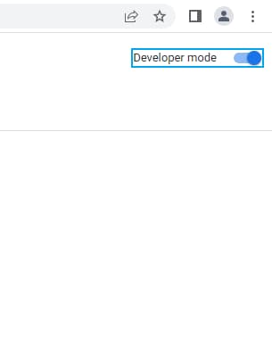

# React With Typescript Chrome Extension in V3 manifest version

This is a boilerplate using react and typescript to create chrome extensions.

### Technologies used

- React 18
- Typescript
- Webpack
- TailwindCSS
- React Testing Library

 

## :bulb: How to install

1. Clone this project

2. Run the following scrips 
- Run `yarn` to install dependencies. 
- Run `yarn build` to generate the build version.

After these steps, a folder called `dist/` will be created. It is this folder that you will use to install the extension on your browser.

3. Open the Chrome extensions page by typing [chrome://extensions](chrome://extensions) in your browser's address bar.
4. Activate developer mode by clicking the "Developer mode" switch in the top right corner of the page.

 

5. To install the extension, simply drag the `dist/` folder that you created in the previous steps to the extensions page.

 

After following these steps, you will be ready to use this extension, as shown in the image below:

